# Digital Chair

Ein interaktiver Stuhl, dessen Sensoren dabei helfen die Sitzhaltung im Büroalltag nachhaltig zu verbessern.

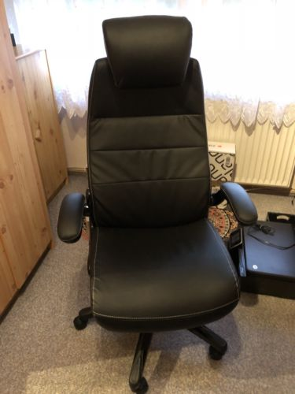

## Einleitung

Viele kennen es. Ständig klagt der Kollege aus dem Büro über Rückenschmerzen, der Tischnachbar über schmerzende Augen oder man selbst hat wieder einen steifen Hals.
Genau dieses Problem soll von nun an behaldelt werden, und das ganz ohne einen Arztbesuch.
Der Seat UP erinnert den Nutzer bei falscher Sitzhaltung via Vibration, sich wieder richtig hinzusetzen. Dabei messen Sensoren an kritischen Punkten den Kontakt zum Stuhl. Sitzt man falsch,
 sieht der Nutzer auf der LED Anzeige, was aktuell falsch ist. Zusätzlich sieht er eine handgemalte Zeichnung zur Erinnerung an die richtige Haltung auf dem Stuhl.

### Material und Werkzeug

Folgende Materialien werden für den Bau des Stuhls benötigt:

- Arduino Mega 2560 inkl USB-A auf B Kabel
- 7x Widerstandsresistoren
- 1x Transistor
- 1x Vibrationsmotor
- 5x Piranha RGB LEDs
- 1x Ultraschall Sensor
- 1x 2.9 inch Waveshare e-Paper module
- 1x Stuhl mit Arm- und Kopflehne
- 1x Korken
- Isolierband
- ca 15m Schaltlitze
- Isolierzange
- 15x 330 Ohm Widerstände
- 7x 10k Ohm Widerstände
- Karton
- Edding
- Schnur

Folgende Werkzeuge werden für den Bau des Stuhls benötigt:

- Heißklebepistole inkl Heißklebepatrone
- Schere
- Schlitz-Schraubenzieher
- Cuttermesser
- [Arduino IDE ](https://www.arduino.cc/en/main/software)
- [ePaper library](https://www.waveshare.com/wiki/2.9inch_e-Paper_Module_(B))
- [img2lcd](https://www.waveshare.com/wiki/2.9inch_e-Paper_Module_(B))
- ein beliebiges Endgerät mit einem Betriebssystem, welches mit der Arduino IDE kompatibel ist

## Vorbereitung

Um ein Programm für den Arduino zu schreiben bzw. um es darauf zu überspielen bietet sich die von Arduino selbst bereitgestellte IDE an. Zwar bietet diese nur eine sehr limitierte Funktionalität an, für unsere Zwecke ist das aber durchaus ausreichend. Die IDE kann [hier](https://www.arduino.cc/en/main/software) heruntergeladen werden.

##Step-by-step Guide

# 1. Stuhl demontieren
Zunächst wird der Stuhl benötigt.
Um sämtliche Sensoren unter dem Leder zu befestigen, muss dieser zuerst demotiert werden. Mit etwas Glück ist dieser getakert und nicht nur genäht. Somit müssen nur die Klammern entfernt werden.
Dies bewerkstelligt man am besten mit einem Schraubenzieher, um die Klammern anzuheben und mit einer Zange dann zu entfernen.

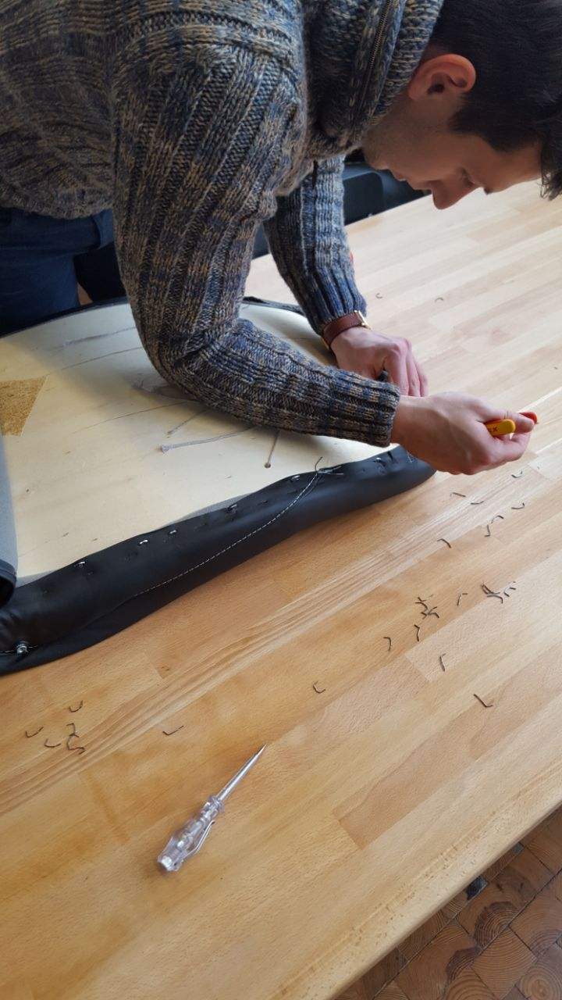

Ist dies geschafft, kann man die Vorderseite nun langsam herunter ziehen. Sollte man einen Stuhl mit Kopflehne haben, so muss man diese erst entfernen und zunächst die beiden Keile entnehmen.
Die Metallplatte, an der die Kopflehne befestigt ist haben wir ebenfalls entfernt, um mehr Spielraum zu haben.

# 2. Planung und Verlötung der Sensoren im Stuhl.
Als nächstes haben wir Überlegungen angestellt, wo wir die Drucksensoren positionieren, die Kabel verlaufen sollen und vor allem, wie wir das best mögliche Ergebnis bekommen.

Erst haben wir die Sensoren an der Oberfläche befestigt, um sie danach unter dem Leder zu montieren. Die Punkte haben wir voher mit einem Edding aufgemacht, sollte der Sensor verrutschen.
Bevor wir die Sensoren eingebaut haben, mussten wir jedoch noch zwei Schaltlitze anlöten. Eins für die Spannung, das andere zu einem 10k Ohm Widerstand welcher dann in den Ground geht.
Sicherheitshalber haben wir die Kabel noch mit Isolierband abgetrennt.

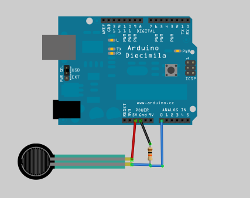

Nachdem wir mit einem Schraubbohrer in das Polster zwei Löcher mit ca. 5mm Durchmesser gemacht haben, konnten wir den Sensor mit einer Schnur befestigen.

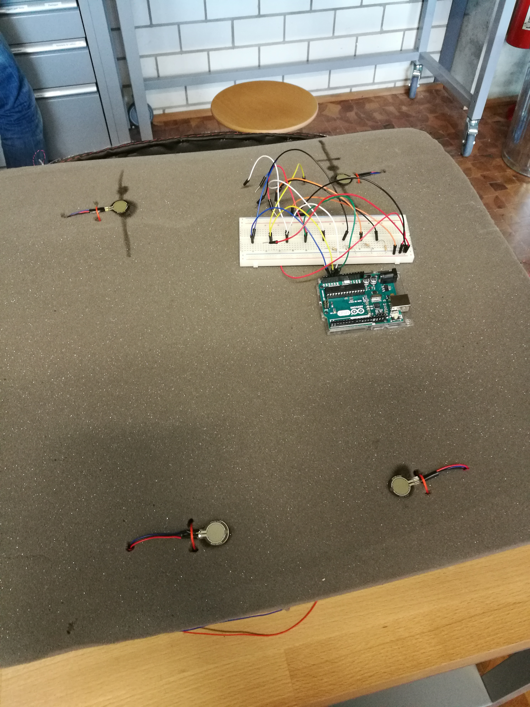

Nach einem kurzen Testlauf mussten wir festestellen, dass die Sensoren durch den Schaumstoff nicht richtig betätigt wurden. Daher fertigten wir aus Kork und Pappe eine kleine Schablone, die dem eine größere Liegefläche bietet und somit viel besser geeignet war für die Sensoren.

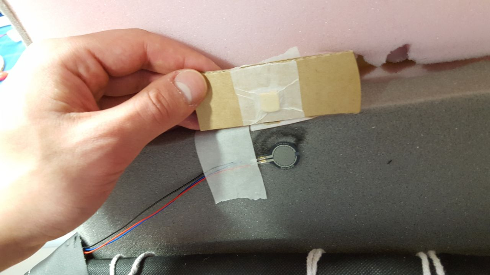

Selbiges haben wir dann mit dem Sitzpolster des Stuhles gemacht. Die Sensoren haben wir so gewähnt, dass sie Kontakt mit dem Glutes und den Oberschenkeln haben.

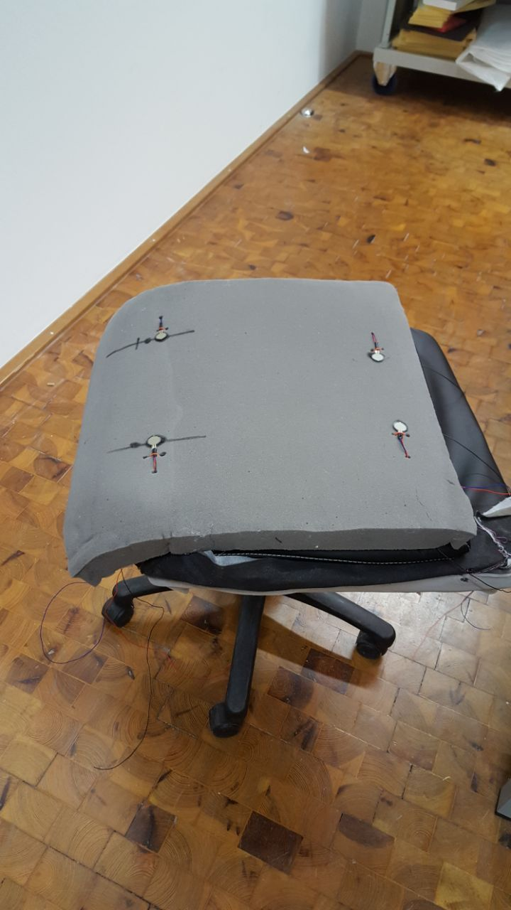

Als letztes haben wir noch aus einem Korken einen kleinen Würfel geschnitten und ein passendes Loch für unseren Vibrationsmotor gebohrt.

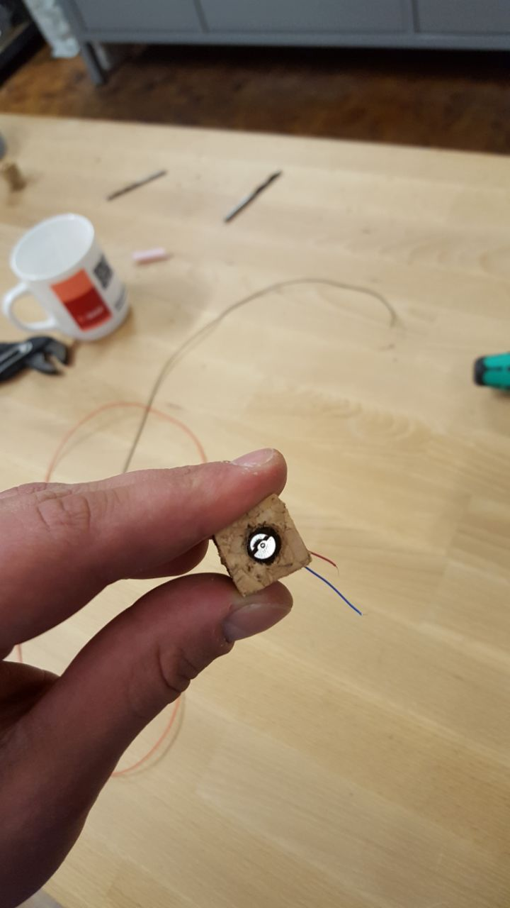

Im Anschluss wurde dieser mit einfachem Isoliertape verbunden und zwischen dem rechten Oberschenkel und Gluteussensor verlegt.

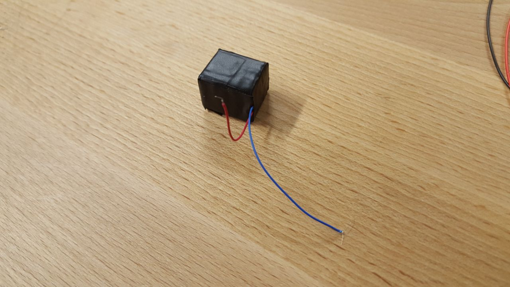

Der Vibrationsmotor funktioniert an sich, wenn man beide Kabel richtig verbindet (rot and 3.3V, blau an ground). Jedoch wollten wir die Vibration über einen Pin steuern können, deshalb haben wir dazu einen Transistor verwendet. Der Transistor ist hierbei notwendig, da unser Vibrationsmotor, obwohl er auf LOW liegt, eine Störspannung von den Piranha LEDs empfängt. Dazu wurde der Vibrationsmotor mit dem Transistor wie folgt verbunden:

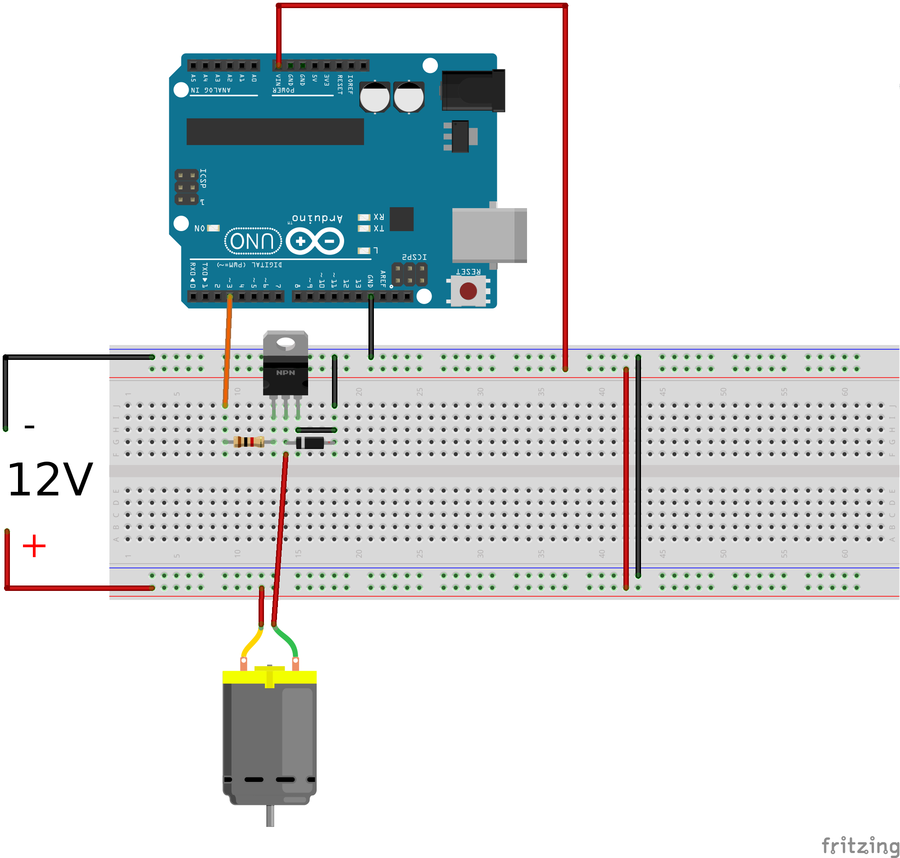

# 3. Ultraschall und Kopfpolster

Nachdem wir das Kopfpolster entfernt haben mussten wir uns überlegen, wie wir den Ultraschallsensor verbauen.
Zunächst haben wir das Polster etwas ausgedünnt, da es schlichtweg zu dick war um eine günstige Sitzhaltung zu gewähren.
Ursprünglich sollte der Ultraschall so platziert werden, um nur den Abstand zum Kopf zu messen. Nun liegt er so, dass sobald der Kopf zu weit nach vorne gebracht wird kein Signal entsteht.

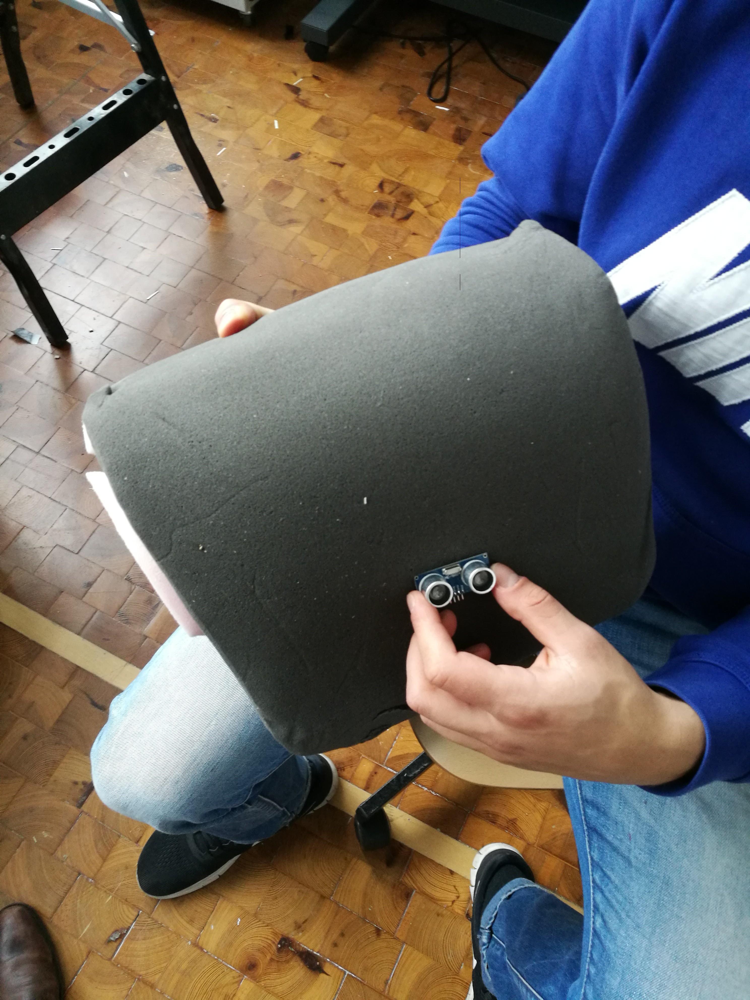

Verlötet wurde der Ultraschallsensor mit vier Schaltlitzen. Ein Schaltbild finden Sie hier:

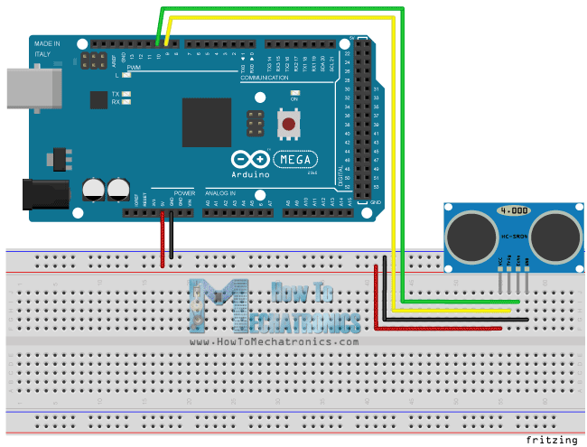

Nachdem wir die richtige Position gefunden haben, haben wir zunächst einen rechteckigen Bereich markiert. Es wurden daraufhin zwei Löcher gebohrt, indem wir den Ultraschallsensor legen konnten. Danach wurde der Ultraschallsensor mit einer Schnur an das Brett der Kopflehne befestigt.

Rückseite             |  Vorderseite
:-------------------------:|:-------------------------:
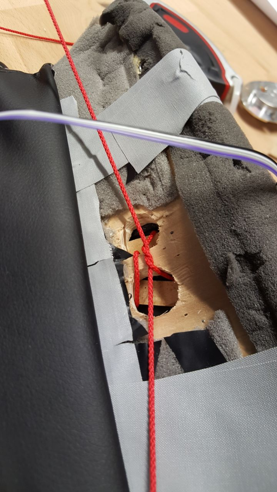  |  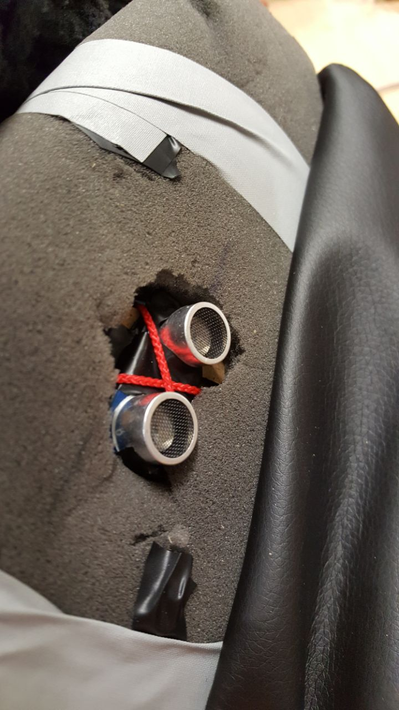

Als letzten Schritt mussten wir zwei Löcher in den Überzug der Kopflehne für den Sender und Empfänger machen. Diesen wurden mit Abtasten herausgefunden. Die Löcher wurden zunächst klein gemacht, und dann wenn nötig, vergrößert. Nun ist der Ultraschallsensor verbaut und es sieht folgendermaßen aus:

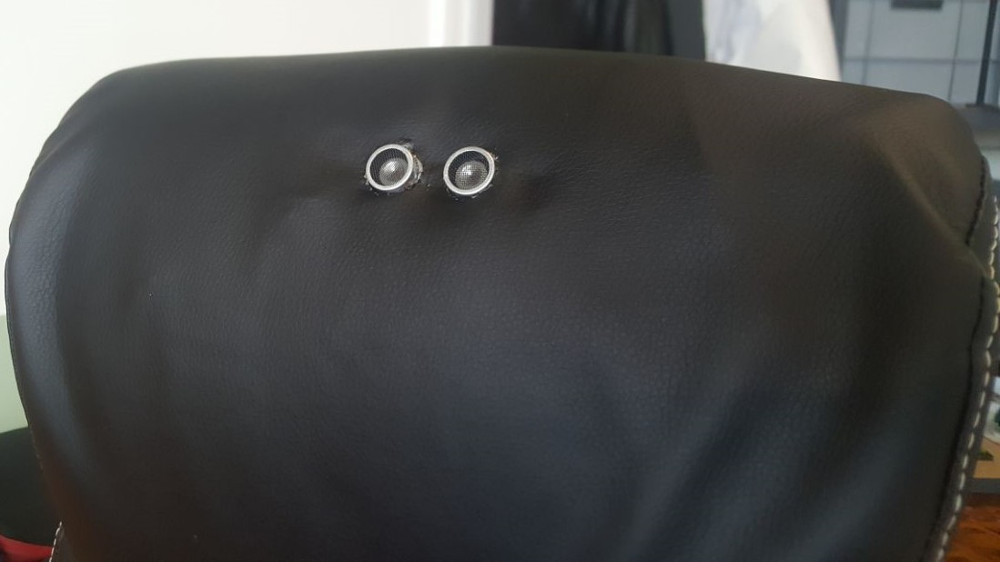 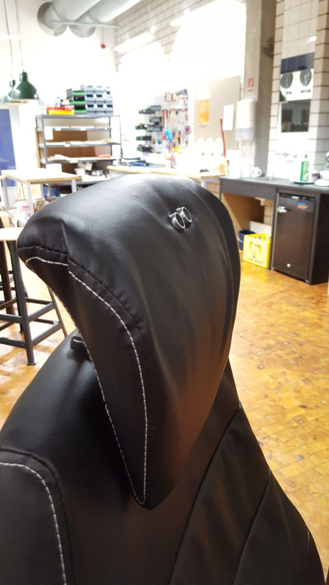

# 4. Armlehne und LED Anzeige

Zum Schluss folgt das Kernstück des Stühls, die Armlehne mit eingebauter LED Anzeige.
Zunächst wurde ein Schaltplan entworfen für die Piranha LEDs.
Dabei benötigt der Pin jeder Kante einen eigenen 330 Ohm Widerstand.

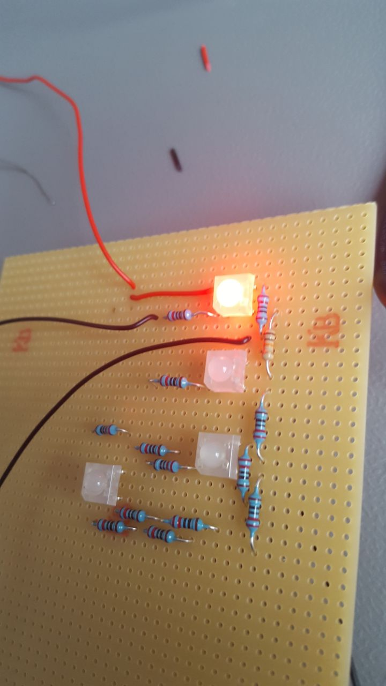

Die Piranha LEDs funktionieren anders als „normale“ LEDs, denn sie werden umgekehrt geschaltet (LOW = an, HIGH = aus). Nachdem alles verlötet und angeschlossen wurde, haben wir einen kleinen Testlauf gemacht, um zu sehen, ob alles richtig funktioniert:

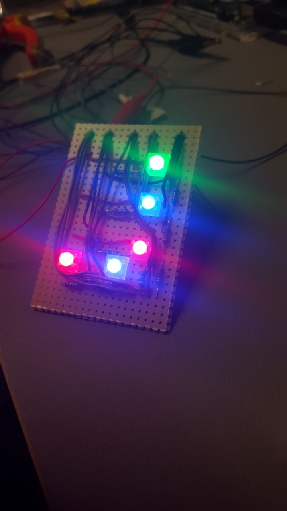

Als letzten Schritt für die LEDs mussten wir sie nun in die Armlehne bringen. Wie vorhin schon erwähnt wurden hier die einzelnen Tacker entfernt und das Polster von der Armlehne getrennt. Nachdem die korrekte Position auf dem Schaumstoff gefunden wurde, haben wir sie zunächst markiert, indem wir unsere Platine darauf gepresst haben.

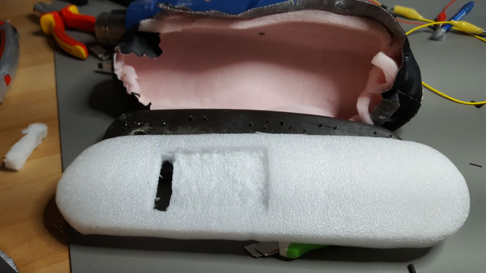

Ein kleiner Bereich davon wurde ausgeschnitten, damit wir die Kabel der Platine unter das Schaumstoff kriegen konnte. Die Platine wurde daraufhin mit Tape befestigt, sodass sie nicht abrutscht.

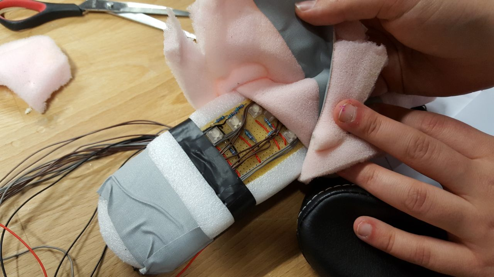

Der pinke Überzug wurde dann mit Punkten markiert, wo sich die LEDs befinden. Diese Punkte wurden dann vorsichtig aufgeschnitten, sodass die LEDs durchleuchten können.
Da sich der pinke Überzug auch noch leicht verschiebbar war, haben wir diesen ebenso mit Tape befestigt.

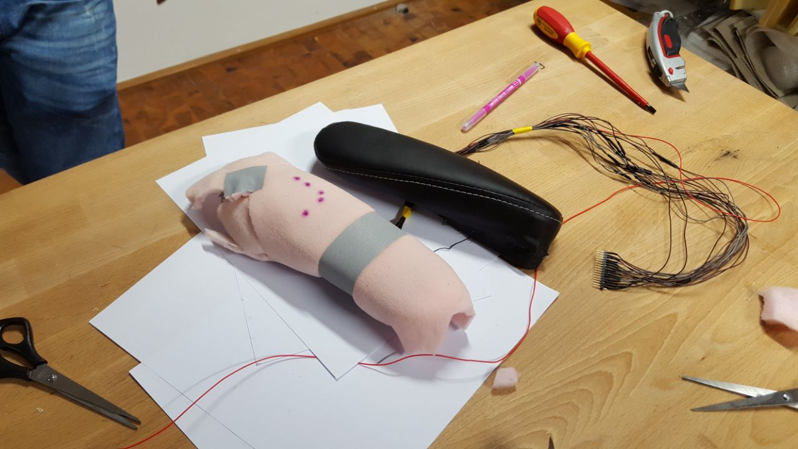

Als letzten Schritt haben wir es wieder verpackt und die einzelne Bereiche, in denen sich die LEDs befinden wieder markiert. Diese Markierungen wurden nach dem gleichen Verfahren wie vorhin vorsichtig ausgeschnitten, sodass die LEDs durchleuchten können. Nachdem alles fertig war, haben wie Lehne wieder zugetackert.

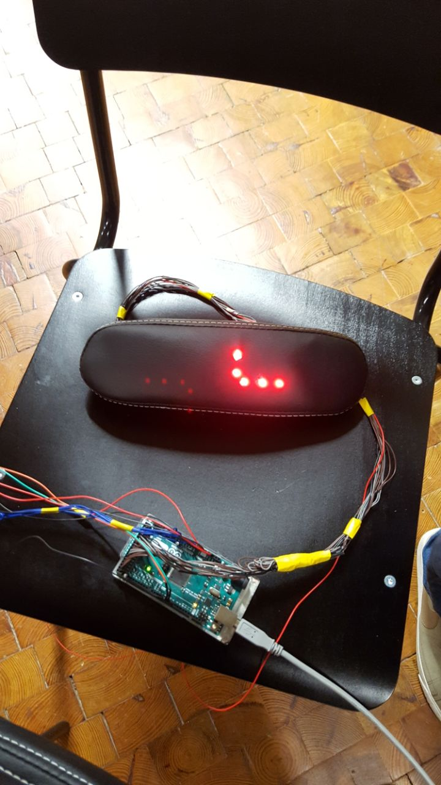

# 5. Das Produkt

Nachdem alle einzelnen Teile wieder zusammen verbaut wurden, sieht das finale Produkt folgendermaßen aus:

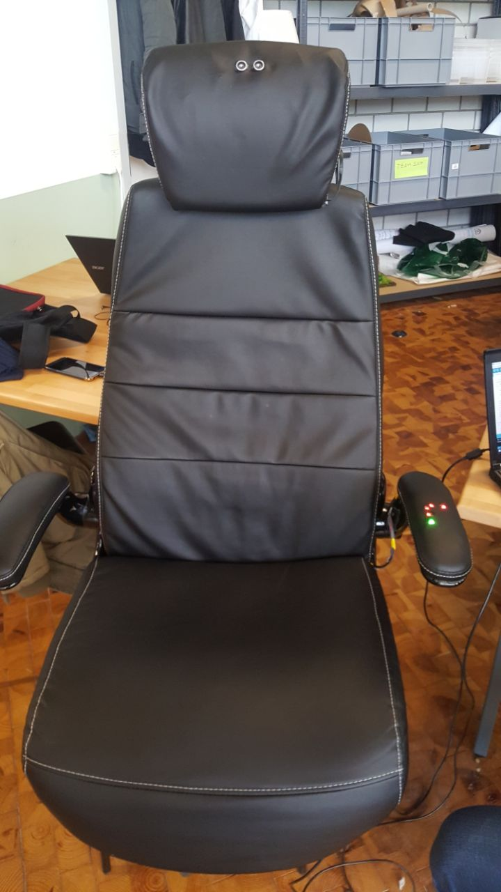

# 6. Zukunftsaussichten

Ursprünglich sollte noch ein Waveshare E-Ink Display in dem Stuhl seinen Platz finden und eine wöchentliche Ansicht über die korrekte Sitzhaltung anzeigen.
Dafür wurde die verlinkte Bibliothek etwas umgeschrieben, weil das Display jeweils schwarze und rote Sketches malt.
Zusätzlich muss man ein Bild in einem Bildeditor der Wahl nach dem Maßen 128x296 Pixeln anfertigen, als .bmp abspeichern und im Programm IMG2LCD zu einem Array konvertieren, welches vom Arduino eingelesen wird. 
Dies muss in den PROGMEM gespeichert werden. Hätten wir bloß eine Person mehr in unserem Team, wäre uns das auch sicher gelungen :)

 | 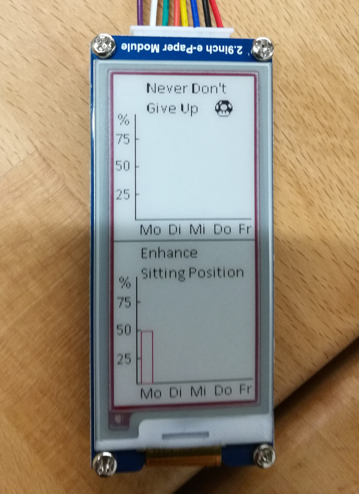

## Authors

* **Hamid Ahmetovic**
* **Mustafa Yildiz**
* **Josip Grabant**

